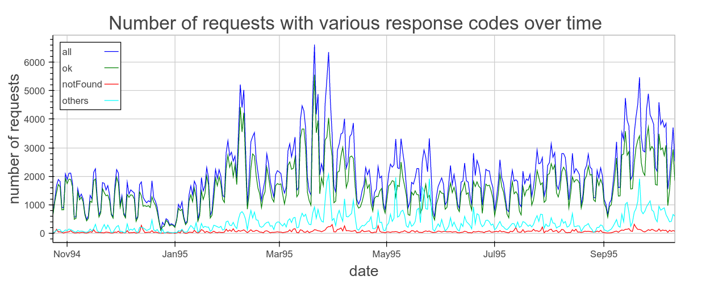

# Web-Server-Log-Analysis-with-PySpark

##### This example demonstrates parsing (including incorrectly formated strings) and analysis of web server log data . 

The lines may look like

* local - - [24/Oct/1994:13:41:41 -0600] "GET index.html HTTP/1.0" 200 150
* remote - - [27/Oct/1994:23:17:17 -0600] "GET index.html 200 3185
* local - - [27/Oct/1994:15:28:10 -0600] "GET index.html Inch Nails HTTP/1.0" 404 -

Out of 726739 log-lines, 723267 are parsed with protocol info, 1847 are parsed without protocol info, 1419 are of the "local index.html"-type and carry no useful information, and 206 lines are left unparsed till further decision.

##### The analysis includes:

1. Step-by-step parsing of log lines to arrive at final "production" parsing code

2. Exploratory data analysis and visualizations

3. Analysis of "notFound" (404) response codes and visualizations

The data are taken from [here](http://ita.ee.lbl.gov/html/contrib/Calgary-HTTP.html). The code assumes that the file "calgary_access_log.gz" is downloaded, gunziped and put into "data" subdirectory.

##### Figures are [interactive online](https://rawgit.com/olalakul/Web-Server-Log-Analysis-PySpark/master/WebLogAnalysis.html)

On the very left of this histogram there are 8751 requests that never (strictly speaking, no more than 1% of the times each was requested) returned "notFound" status. Everything looks good for those. On the very right of this histogram there are 2920 requests that very always (stricty speaking, more than 99% of the times each of those was requested) not found. Those definitely require further investigation.
